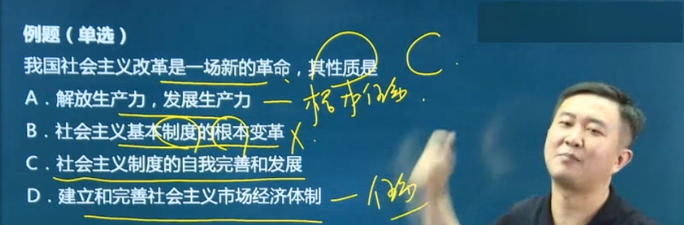
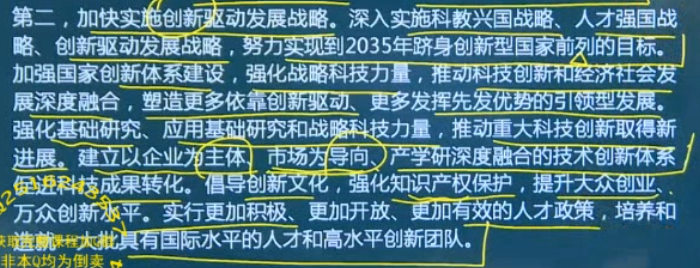

# 毛概

## 毛泽东思想

### 新民主主义革命理论（-1949）

1. 近代中国国情和中国革命的时代特征

    国情：半殖民地半封建社会；经济、政治、文化发展极不平衡

    近代半殖民地半封建社会性质，**决定**社会主要矛盾为帝国主义和中华民族的矛盾、封建主义和人民大众的矛盾，前一矛盾为主要矛盾

    近代社会性质和主要矛盾，**决定**中国革命根本任务是推翻帝、封、官，建立富强民主国家。**决定**中国革命是资产阶级民主革命（十月革命为界限，前面为属于旧资产阶级民主主义革命范畴，属于旧资产阶级民主革命一部分；后面为属于新的资产阶级民主革命范畴，属于无产阶级社会革命一部分）

    五四运动以后，中国**资产阶级**民主革命进入新民主主义革命的崭新阶段。五四以前都是旧民主主义革命

1. 新民主主义革命理论的实践基础

    1. 就民主主义革命的失败呼唤新的革命理论的诞生

    1. 新民主主义革命的**实践**探索奠定了革命理论形成的基础

1. 各种问题

    中国革命的基本问题是农民问题，中心问题是无产阶级的领导权，首要问题是分清敌友

1. 新民主主义革命的总路线

    1. 总路线

        

        1. 对象

            **帝国主义**、封建主义、官僚资本主义

        1. 动力

            **无产阶级**、农民阶级、城市小资产阶级、民族资产阶级

            

        1. 领导者

            

            

        1. 新民主主义革命性质和前途

            

            

            

    1. 总纲领

        1. 政治

            

        1. 经济、文化

            

            

    1. 总道路

        

        

        

        

    1. 总经验

        

        

        武装斗争是中国革命的特点和优点之一

        中国共产党要领导革命取得胜利，必须不断加强党的**思想建设**、组织建设和作风建设

        习近平建设：思想、组织、作风、**政治**、纪律、制度建设

### 社会主义改造理论（1949-1956）

1. 新民主主义社会性质特点

    

    在我国新民主主义社会（1949-1956），虽然非社会主义因素比例大，但是社会主义因素在经济、政治上居于**领导地位**。

1. 党在过渡时期的总路线及其理论依据

    | 时期                    | 总路线                                                                                          |
    | ------------------------- | -------------------------------------------------------------------------------------------------- |
    | 新民主主义革命（-1949） | 无产阶级领导的，人民大众的，反对帝国主义、封建主义和官僚资本主义的革命 |
    | 党在过渡时期（1949-1956） | “一化三改”：“一化”即社会主义工业化；“三改”即对个体农业、手工业何对资本主义工商业的社会主义改造 |
    | 今天                    | “一个中心，两个基本点”：一个中心，指以经济建设为中心；两个基本点，指坚持四项基本原则，坚持改革开放 |

1. 适合中国特点的社会主义改造道路

    | 时期                      | 道路                     |
    | --------------------------- | -------------------------- |
    | 新民主主义革命道路（-1949） | 农村包围城市，武装夺取政权 |
    | 过渡时期（1949-1956） | 合作化                  |
    | 今天                      | 中国特色社会主义道路 |

    和平赎买是方法不是形式，从低级到高级的国家资本主义是过渡形式

1. 社会主义改造的历史经验

    “一化三改”要同时并举；采取积极引导、逐步过渡的方式；用和平方法进行改造

1. 社会主义基本制度的确立及其理论依据

    国情改变：社会主义初级阶段

    社会主义经济从领导地位改变为主体地位

1. 确立社会主义基本只读的重大意义

    

    

### 初步探索的理论成果（1956-1976）

1. 调动一切积极因素为社会主义事业服务的思想

    社会主义建设的原则（指导思想）：独立自主

    方针：调动一切积极因素为社会主义建设服务

1. 正确认识和处理社会主义社会矛盾的思想

    基本矛盾：生产关系和生产力之间的矛盾，上层建筑和经济基础之间的矛盾

    | 领导人 | 我国社会的主要矛盾                                                                                                                                                |
    | ------ | -------------------------------------------------------------------------------------------------------------------------------------------------------------------------- |
    | 毛泽东（党的八大） | 我们国内的主要矛盾已经是人民对于建立先进的工业国的要求同落后的农业国的现实之间的矛盾，已经是人民对于经济文化迅速发展的需要同当前经济文化不能满足人民需要的状况之间的矛盾。 |
    | 邓小平（十一届六中全会） | 人民日益增长的物质文化需要同落后的社会生产之间的矛盾                                                                                             |
    | 习近平（党的十九大）| 人民日益增长的美好生活需要和不平衡不充分的发展之间的矛盾                                                                                       |

1. 走中国工业化道路的思想

    重、轻、农三者关系问题就是工业化道路问题

    

1. 初步探索的其他理论成果

    

    

1. 社会主义建设道路初步探索的意义

    

1. 社会主义建设道路初步探索的经验教训

    

1. 补充

    

    

## 中国特色社会主义理论体系

### 邓小平理论

1. 邓小平理论的形成条件

    时代背景：和平与发展（毛泽东思想时代背景：革命与战争）

    历史依据：社会主义建设的经验教训

    现实依据：改革开放和现代化建设的实践

    东西问题（和平）：资本主义和社会主义

    南北问题（发展）：发达国家和不发达国家

1. 邓小平理论的形成过程

    | 会议                 | 内容                                                                   |
    | ---------------------- | ------------------------------------------------------------------------ |
    | 十一届三中全会（开端） | 重新确立了解放思想、实事求是的思想路线                |
    | 十二大（提出“中特”主义） | “中国特色社会主义”成为我们党的全部理论和实践创新的主题 |
    | 十三大（阐述“中特”理论） | 第一次系统论述我国社会主义初级阶段理论；第一次对“中特”主要内容做系统概括 |
    | 1992年南方谈话    | 邓小平理论逐步走向成熟                                        |
    | 十四大              | 总结改革开放十四年来巨大成就，首次确立了建立社会主义市场经济的改革目标 |
    | 十五大      | 把邓小平理论同马列主义、毛泽东思想写入党章          |
    | 十七大（建立“中特”体系） | 提出“中国特色社会主义理论体系”的科学概念 |

1. 邓小平理论回答的基本问题

    | 领导人 | 回答的问题                                                          |
    | ------ | ------------------------------------------------------------------------ |
    | 毛泽东 | 什么是马克思主义、怎样对待马克思主义                   |
    | 邓小平 | 什么是社会主义、怎样建设社会主义                         |
    | 江泽民 | 建设什么样的党、怎样建设党                                  |
    | 胡锦涛 | 实现什么样的发展、怎样发展                                  |
    | 习近平 | 新时代坚持和发展什么样的中国特色社会主义、怎样坚持和发展中国特色社会主义 |

    社会主义的本质，是解放生产力，发展生产力，消灭剥削，消除两极分化，最终达到共同富裕。（处理了生产力和生产关系。相对毛泽东而言，毛只处理了生产关系，不关注生产力，因为虽然没有剥削，但是变得越来越穷）

    根本原则：社会主义公有制经济为主体；共同富裕

1. 邓小平理论的主要内容

    1. 解放思想、实事求是的思想路线（邓小平理论活的灵魂）

        中国共产党的**思想路线**：一切从实际出发（前提），理论联系实际（途径、方法），实事求是（实质、核心），在实践中检验和发展真理（检验条件、目的）

    1. 社会主义初级阶段理论

        把“社会主义初级阶段”作为国情是在十三大

        原因（条件）：我国生产力落后、商品经济不发达

    1. 党的基本路线

        

        出发点、落脚点、归宿、根本目的：人；立足点：独立自主、自力更生；根本保证：党的领导；前提：社会稳定

        

    1. 社会主义根本任务的理论

        生产力是社会发展的最根本的决定性因素，社会主义的根本任务是发展生产力

    1. “三步走”战略

        

        邓小平说21世纪中叶基本实现社会主义现代化；习近平说2035基本实现社会主义现代化，2050实现社会主义强国

    1. 改革开放理论

        

        制度只能完善，体制要根本性的变革

        改革是什么（性质）：它是社会主义制度的自我完善和发展

        改革是发展的**直接动力**，基本矛盾（生产力、生产关系的矛盾，经济基础和上层建筑的矛盾）是发展的**根本动力**

    1. 社会主义市场经济理论

        经济体制改革的核心问题是处理计划（政府）和市场的关系

        

    1. “两手抓，两手都要硬”

        物质文明和精神文明都搞好

    1. “一国两制”

    1. 中国问题的关键在于党

    

1. 邓小平理论的历史地位

    

### 三个代表重要思想、科学发展观

1. “三个代表”重要思想的形成条件

1. “三个代表”重要思想的形成过程

    回答问题：建设什么样的党、怎样建设党

    | 思想             | 写入党章时间 |
    | ------------------ | ------------ |
    | 毛泽东思想    | 七大       |
    | 邓小平理论    | 十五大    |
    | “三个代表”重要思想 | 十六大    |
    | 科学发展观    | 十七大             |
    | 习近平中国特色社会主义思想 |  十九大 |

1. “三个代表”重要思想的核心观点

1. “三个代表”重要思想的主要内容

    1. 发展是党执政兴国的第一要务

    1. 建立社会主义市场经济体制

        我国不是社会主义经济（只有公有制），也不是资本主义经济（只有私有制），而是社会主义**市场**经济（公有制、非公有制）

        进一步探索公有制经济特别是国有制的多种有效**实现形式**（单一制，100%控股；混合制），如农村合作信用社改为了农村商业银行

        

    1. 全面建成小康社会

        

    1. 建设社会主义政治文明

        

        

    1. 推进党的建设新的伟大工程

1. “三个代表”重要思想的历史地位

    

1. 科学发展观的形成条件

1. 科学发展观的形成过程

    写入党章：十七大

1. 科学发展观的科学内涵

1. 科学发展观的主要内容

1. 科学发展观的重要意义

    

### 新时代思想

#### 新时代的新思想及其历史地位

1. 社会主要矛盾的变化及其依据

    党的十九大：我国社会主要矛盾已经转化为人民日益增长的美好生活需要和不平衡不充分的发展之间的矛盾

    依据：生产力水平总体显著提高；人民生活水平显著提高（不仅对**物质文化生活**提出更高要求，在**民主、法治、公平、正义、安全、环境等方面**的要求日益提高）；影响满足人们美好生活需要的主要因素是发展不平衡、不充分问题

    两个没有变（基本矛盾已经变了）：国情（社会主义初级阶段）；国际地位（最大的发展中国家）

1. 新时代的内涵和意义

    

    意义：对中华民族复兴来说，迎来了近代以来从站起来、富起来到强起来的飞跃；对科学社会主义发展进程来说，中特在我国焕发强大生机，在世界高高举起中特伟大旗帜；对人类文明进程来说，为世界提供中国智慧、中国方案

1. 习近平新时代中国特色社会主义思想的核心要义和丰富内涵

    主要创立者是习近平。

    核心要义：坚持和发展中国特色社会主义

    “八个明确”（怎么看）

    1. 总任务是实现社会主义现代化和中华民族伟大复兴

    1. 明确社会主要矛盾为人民日益增长的美好生活需要和不平衡不充分的发展之间的矛盾

    1. 总体布局是“五位一体”，战略布局是“四个全面”，强调坚定道路自信、理论自信、制度自信、文化自信

    1. 明确全面深化改革总目标是：完善和发展中特制度、推进国家治理体系和治理能力现代化

    1. 明确全面推进依法治国总目标是建设中特法制体系、建设社会主义法治国家

    1. 新时代强军目标是建设一支听党指挥、能打胜仗、作风优良的人民军队

    1. 明确中国特色大国外交要：推动构建新型国际关系；推动构建人类命运共同体

    1. 中特最本质的特征是中国共产党领导，突出政治建设在党的建设中的重要地位

    毛泽东党的建设主要是思想建设，习近平党的建设主要是政治建设

1. 坚持和发展中国特色社会主义的基本方略

    基本方略：“十四个坚持”（怎么办）

    

    

    

    "八个明确"（怎么看）和“十四个坚持”（怎么办）体现了习近平新时代中国特色社会主义思想理论与实践的统一

1. 习近平新时代中国特色社会主义思想的历史地位

    1. 马克思主义中国化最新成果

    1. 新时代的精神旗帜

    1. 实现中华民族伟大复兴的行动指南

#### 新时代中国特色社会主义的总任务

1. 中华名族伟大复兴的中国梦的提出

    

1. 中国梦的科学内涵

    国家富强、民族振兴是人民幸福的保障

    人民幸福是国家富强、民族振兴的必然要求、根本出发点

1. 奋力实现中国梦

    实现中国梦必须走中国道路、弘扬中国精神、凝聚中国力量

1. 开启全面建设社会主义现代化强国的新征程

    2020-2035：在全面建成小康社会的基础上，到2035年基本实现社会主义现代化

    2035-2050：在基本实现现代化的基础上，再奋斗15年，把我国建成富强民主文明和谐美丽的社会主义现代化强国

1. 实现社会主义现代化强国“两步走”战略的安排

    2035：不是基本实现的：进入创新型国家前列；经济发展从量的扩张向质的提高的根本转变；我国进入高收入国家行列；生态环境根本好转

    2050：是基本实现的：人民共同富裕基本实现；

#### 新时代中国特色社会主义的布局

##### “五位一体”之经济

1. 贯彻新发展理念

    创新是引领发展的第一动力

    协调是持续健康发展的内在要求

    绿色是永续发展的必要条件

    开放是国家繁荣发展的必由之路：互利共赢的开放战略；引进来和走出去并重、引资和引技引智并举。开放的格局：全方位、宽领域、多层次

    共享是中国特色社会主义的本质要求

    创新（解决发展动力问题）、协调（发展不平衡问题）、绿色（人与自然和谐问题）、开放（发展内外联动问题）、共享（社会公平正义问题）

1. 深化供给侧结构性改革

    1. 推进增长动能转换，以加快发展先进制造业为重点全面提升实体经济

    1. 深化要素市场化配置改革，实现由以价取胜向以质取胜的转变

    1. 加大人力资本培育力度，更加注重调动和保护人的积极性

    1. 持续推进“三去一降一补”，优化市场供求结构

1. 建设现代化经济体系及其主要任务

    经济体系

    

    主要任务

    1. 大力发展实体经济

    1. 加快实施创新驱动发展战略

        

    1. 激发各类市场主体活力

    1. 积极推动城乡区域协调发展

    1. 着力发展开放型经济

    1. 加快完善社会主义市场经济体制

##### “五位一体”之政治

1. 坚持走中国特色社会主义政治发展道路

    

1. 健全人民当家做主制度体系

    国体：我国是工人阶级领导的、以工农联盟为基础的人民民主专政的社会主义国家

    制度（一个根本，三个基本）：人民代表大会制度；基层群众自治制度；政协制度；民族区域自治制度

    人大是一种间接民主制度；人大是分层次的；基层民主是直接民主制度（农村村委会、城镇居委会、企业职工代表大会）

    **协商民主**（不是政协制度）是中国社会主义民主政治的特有形式和独特优势

1. 巩固和发展爱国统一战线

    宗教原则：独立自主自由；政教分离

    处理民族问题原则（不是制度）：民族团结、民族平等、各民族共同繁荣

1. 坚持“一国两制”，推进祖国统一

    新时代中国共产党、中国政府的三大历史任务：祖国统一；社会主义现代化；世界和平

    

##### “五位一体”之文化、社会、生态

生态文明的核心是坚持人与自然和谐共生

人与自然：坚持保护优先、自然修复为主

##### “四个全面”之全面建成小康社会

1. 全面建成小康社会的内涵

1. 全面建成小康社会的目标要求

1. 决胜全面建成小康社会

##### “四个全面”之全面深化改革

1. 坚定不移地全面深化改革

    全面深化改革作为“四个全面”战略布局中具有突破性和先导性的**关键环节**

    全面建成小康社会。。。。。。**引领地位**

    

    市场在资源配置中起决定性作用

1. 全面深化改革的总目标和主要内容

    

1. 正确处理全面深化改革中的重大关系

    

    改革是动力、发展是关键、稳定是前提

##### “四个全面”之全面依法治国

1. 全面依法治国方略的形成发展

    全面依法治国是中国特色社会主义的本质要求和重要保障

1. 中国特色社会主义法治道路

    党的领导和依法治国是高度统一的，党的领导是社会主义法治最根本的保证

    法律具有规范作用，道德具有教化作用；法律对道德有促进作用，道德对法律有支撑作用

1. 深化依法治国实践的重点任务

    全面依法治国的总目标是建设中特法制体系、建设社会主义法治国家

##### “四个全面”之全面从严治党

1. 新时代党的建设总要求

    “坚持党要管党、全面从严治党”是新时代党的建设的根本方针

1. 把党的政治建设摆在首位

    立场第一

    保证全党服从中央，坚持党中央权威和集中统一领导，是党的政治建设的首要任务

    

1. 全面从严治党永远在路上

    思想建设（基础性建设）、组织建设、作风建设（核心是保持党和人民群众的血肉联系）、制度建设、反腐斗争

#### 新时代中国特色社会主义的内外条件和领导核心

1. 习近平的强军思想

    强军目标是建设一支听党指挥、能打胜仗、作风优良的人民军队

    2020：国防和军队建设要基本实现机械化，信息化建设取得重大进展；2035：基本实现国防和军队现代化；2050：把人民军队全面建成世界一流军队

    建军之本、强军之魂是党对军队绝对领导

    鲜明特色和政治优势是作风优良

    必须坚持政治建军、改革强军、科技兴军、依法治军

    军民融合发展是兴国之举、强军之策；军民融合深度发展格局是要全要素、多领域、高效益发展

1. 坚持党对人民军队的绝对领导

    党对军队的绝对领导是中国特色社会主义的本质特征，是党和国家的重要政治优势

1. 建设世界一流军队

    

1. 坚持富国和强军相统一

    

1. 加快形成军民融合深度发展格局

    

1. 世界正处于大发展大革命大调整时期

    1. 世界多极化在曲折中发展

    1. 经济全球化深入发展

    1. 文化多样化持续推进

    1. 社会信息化快速发展

    1. 科学技术孕育新突破

1. 坚持独立自主和平外交政策

1. 推动建立新型国际关系

    中国秉持共商共享的全球治理观

1. 构建人类命运共同体思想的内涵

1. 促进“一带一路”国际合作

    

1. 共商共建人类命运共同体

    

1. 中国共产党的领导地位是历史和人民的选择

1. 中国特色社会主义最本质的特征

    十三届全国人大第一次会议审议通过的宪法修正案，把“中国共产党的领导是中国特色社会主义最本质的特征”载入宪法总纲

1. 新时代中国共产党的历史使命

    

1. 党是最高政治领导力量
