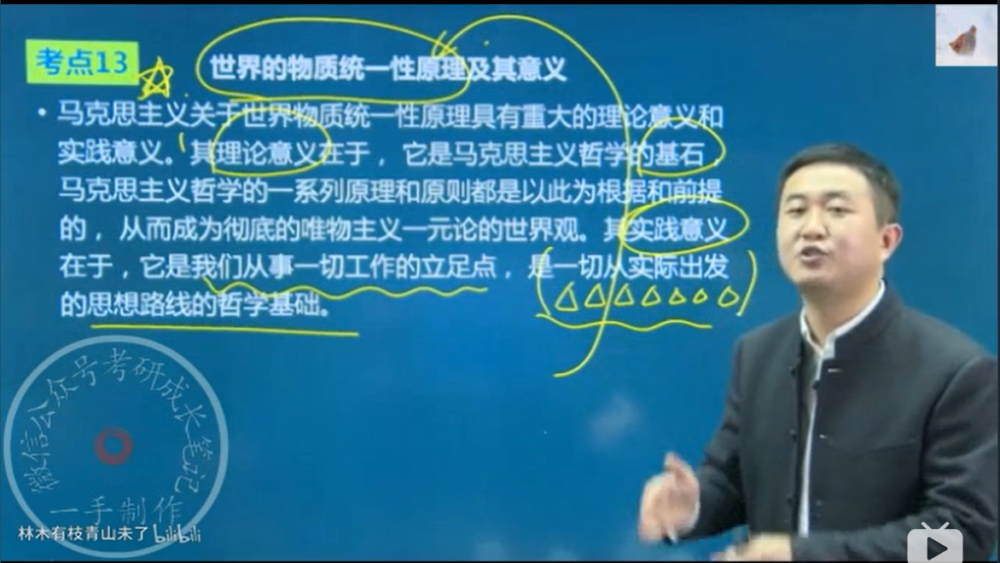
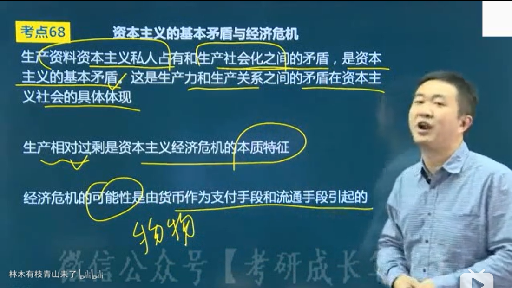

# 马原

## 关系

不可分割：物质和意识、物质运动和时空

对立统一（有区别和联系）：剩下所有

## 导论

1. 马原产生

    

1. 马原科学性和革命性的统一

    马克思主义的强大生命力的根源在于以**实践**为基础的**科学性**和**革命性**的统一。

1. 马原独有特点

    实践、科学

1. 马克思主义世界观、政治立场、理论品质、社会理想

    

## 唯物论（物质与意识）

1. 哲学基本问题以及不同哲学流派

    

1. 世界是怎么存在的？

    形而上学：孤立、片面、静止、无矛盾

    辩证法：联系、全面、发展、矛盾

1. 马克思在哲学史上的两大历史贡献是

    历史唯物主义、辩证唯物主义

1. 物质是什么？

    列宁：物质是标志客观实在的哲学范畴，这种客观实在是

    1. 人通过感觉感知的

    1. 它不依赖于我们的感觉而存在

    1. 为我们的感觉锁复写、摄影、反映

    定义方式：通过物质和意识的关系

    物质的唯一特征：客观实在

1. 物质和运动

    

1. 运动和静止

    静止：静止是运动在一定条件下的稳定状态，包括**空间位置**和**根本属性** **暂时**未改变。

1. 存在方式

    1. 运动是物质的存在方式

    1. 时空是（物质）运动的存在方式

1. 物质运动与时空

    定义：时间是指物质运动的持续性、延续性，特点是一维性，及一去不复返；空间是指物质运动的广延性、伸张性，特点是三维性。

    时空特点：客观性、绝对性、相对性、有限性、无限性

1. 意识的本质

    是人脑的机能和属性、是客观（物质）世界的主观映象。

1. 意识的起源

    自然界长期发展的产物

    1. 一切物质所具有的反应特性到低等生物的刺激感应性

    1. 再到高等动物的感觉和心理

    1. 最终发展为人类的意识

1. 影响意识的因素

    决定性：劳动；语言：重要因素

1. 语言是意识的物质外壳

1. 意识的作用

    

1. 物质与意识的关系

    

1. 世界的物质统一性原理及其意义

    

1. 共产党一切以实际出发。。。

    

## 辩证法

1. 系统的整体性

    1. 整体具有部分所不具有的新功能

    1. 脱离了整体的部分将丧失原有的功能

1. 发展

    发展是前进的上升的运动。

    运动=发展>发展

1. 新旧事物的关系

    

1. 过程的观点

    1. 世界不是既成事物的集合体，而是过程的集合体

    1. 一切在历史上产生的都要在历史上灭亡

    1. 任何事物都有它的过去、现在和将来

1. 五对范畴

    1. 原因和结果

        原因结果相互作用互相影响，互为因果；原因和结果的关系是复杂多样的

        方法论：凡事预则立，不预则废。

    1. 必然性和偶然性

        必然是事物联系、发展中的必然趋势，偶然则是不确定的

        方法论：重视必然规律，善于抓住偶然机遇

    1. 可能性和现实性

        可能是未发生，现实是已发生；现实的可能是依据充分的可能，抽象的可能是依据不充分的可能。

        方法论：立足现实，对可能性做分析和预判，着眼长远，防止坏的可能变成现实，促使好的可能变成现实

    1. 现象和本质

        现象是多变的，本质是相对稳定的；本质是通过现象表现出来。假象也是本质的现象

        方法论：科学的任务就是准确判别真象和假象，透过现象把握本质

    1. 内容和形式

        方法论：重视内容，根据内容需要决定形式的取舍；善于运用形式，发挥积极作用，适时地抛弃与内容不相适应地形式

1. **三大规律**

    1. 对立统一规律（唯物辩证法地实质和核心）（背）

        1. 同一性和斗争性**关系原理**：不是时而时而的关系，是既又得关系

            

            矛盾得同一性和斗争性是相互联结、相辅相成的。没有斗争性就没有同一性，没有同一性也没有斗争性，斗争性寓于同一性之中，同一性通过斗争来体现。矛盾的**同一性是有条件的、相对的**，矛盾的**斗争性是无条件的、绝对的**。

            方法论：看问题要一分为二；求同存异；批判地继承；事物之间会相互转换。

        1. 同一性和斗争性在事物发展中的**作用原理**

            

            方法论：事物的发展不仅表现为“相反相成”，而是表现为“相辅相成”；学会从事物的对立面把我事物的统一，你想思考；和谐不是无差别的一致。

        1. 内因外因的辩证**关系原理**

            方法论：事物的发展是由内因决定的，并受外因影响

        1. 矛盾的普遍性和特殊性的辩证**关系原理**

            方法论：具体问题具体分析，对症下药

        1. 矛盾的不平衡发展原理

            原理：事物的性质是由主要矛盾的主要方面决定的。

            方法论：“两点论”与“重点论”相结合；抓关键，看主流

        

    1. 质量互变规律

        

        

        

        

    1. 否定之否定原理

        

        

## 认识论

1. 实践的含义、特征和基本形式

    实践的本体只能是**人**。

    实践是物质。

    人的活动：本能活动、实践活动（区别于动物）

1. 主体、客体、和中介

    不是所有的人都是主体，必须是有思维能力、从事社会实践和认识的人。

    主体任务：设定实践目的、操作实践中介、改造实践客体。

    主体能力：自然能力、精神能力。

    精神能力包括：知识型因素、非知识性因素。

    客体：实践和认识活动所指向的对象。

    中介：物质性工具、符号工具。

    主客体关系：实践关系、认识关系、价值关系

    相互作用：定目标、付实践、调结果

1. 实践决定认识

    

1. 认识对实践具有指导作用。

1. 感性认识和理性认识的辩证关系

1. 真理的属性：客观性、绝对性和相对性

1. 真理和谬误关系

    真理在一定范围内是真理，超出范围为谬误。如牛顿力学

## 唯物史观

1. 社会存在和社会意识

    随着社会存在的发展，社会意识也相应地**或迟或早**地发生变化和发展。

    社会意识与社会存在发展的**不平衡性**。

1. 生产力和生产关系

    生产资料=劳动资料+劳动对象。

    生产方式=生产力+生产关系

    

1. 经济基础与上层建筑

    经济基础=生产关系，所以生产力也决定经济基础

    意识形态又称观念上层建筑；政治法律只读及设施和政治组织又称政治上层建筑

    

    

1. 社会形态

    社会形态是经济基础与上层建筑的统一体，也即社会形态包括经济形态、政治形态、意识形态

1. 社会形态更替

    社会形态更替的必然性与人们的历史选择性

1. 社会发展的动力

    社会基本矛盾（生产力和生产关系、经济基础和上层建筑的矛盾）：根本动力；阶级斗争；社会革命；改革；科学技术

1. 历史创造者

1. 现实的人及本质

    从人与动物相区别的层次上，人的本质在于劳动；从人与人相区别的层次上，人的本质是一切社会关系的总和。

1. 人民群众创造历史

    人民群众指推动历史发展起推动作用的人们；人名群众发展受历史条件制约，包括经济、政治、精神文化影响，其中经济条件是根本原因

## 政治经济学

1. 商品

    商品是用来交换的、能满足人的某种需要的劳动产品，具有使用价值和价值两个因素，是使用价值和价值的矛盾统一体。

1. 使用价值、价值、交换价值

    使用价值是指商品的有用性，是商品的自然属性；价值是凝结在商品中无差别的一般人类劳动，即人的脑力和体力的耗费，价值是商品的社会属性，空气没有价值但是有使用价值；价值是交换价值的基础，交换价值是价值的表现形式

1. 价值、使用价值的关系

    对立统一：不可兼得，缺一不可

1. 劳动二重性

    

    具体劳动是劳动的自然属性，抽象劳动是商品的社会属性

1. 价值如何衡量

    决定商品价值量的不是生产商品的个别劳动实践，是只能是社会必要劳动时间；商品价值量与生产商品所耗费的劳动时间成正比，与劳动生产率成反比

    

1. 价值如何表现

    简单或偶然的价值形式；货币形式。

    金银天然不是货币，货币天然是金银

    

    

    纸币理论是0价值；纸币没有价值尺度的功能

1. 价值规律

    基本内容：商品的价值量由商品的社会必要劳动时间决定；商品交换以价值量为基础，按照等价交换的原则进行

    表现形式：商品的价格围绕价值自发波动

    价格：供需；币值；价值

    作用：自发调节生产资料和劳动力在社会各生产部门之间的分配比例；自发地刺激社会生产力地发展；自发地调节社会收入分配

1. 商品经济的基本矛盾

    私人劳动和社会劳动的矛盾

1. 劳动力商品的价值和使用价值

    

    

1. 剩余价值的生产

    具体劳动任务：转移“面粉”的价值；生产“包子”的使用价值

    抽象劳动任务：生产新价值

    商品价值=不变资本C+可变资本V+剩余价值M

    剩余价值率M'=M/V=剩余劳动/必要劳动

    绝对剩余价值：生产效率没有提高，必要劳动时间延长

    相对剩余价值：生产效率提高，缩短必要劳动时间

    超额剩余价值：个别企业由于提高生产率而是商品的个别价值低于社会价值的差额。

    超额是原因，相对是结果

1. 资本积累

    概念：把剩余价值转换为资本，或者说剩余价值的资本化，就是资本积累。

    资本积累是资本主义再生产的源泉。剩余价值是资本积累的源泉。

    资本的技术构成：生产资料：劳动力

    资本的价值构成：不变资本：可变资本（C：V）

    资本的有机构成：由资本的技术构成决定并反映技术构成变化的资本的**价值构成**，叫做资本的**有机构成**，通常用C：V来表示。如果技术构成不变，价值构成却变了，比如生产资料涨价了，那此时的价值构成就不是有机构成

    资本积累->资本有机构成提高->相对剩余人口过剩（失业）->贫富差距拉大（两极分化）->资本主义灭亡

1. 剩余价值的循环

    

    影响因素：资本周转时间；生产资料中固定资本和流动资本的构成，流动资本越多越快

    

    

1. 剩余价值的分配

    生产价格=生产成本+平均利润

    

    平均利润率是由**行业间**竞争形成的，超额利润（超额剩余价值）是由**行业内企业间竞争**形成的

1. 马克思的贡献

    哲学史上：创立唯物史观；形成辩证唯物主义

    理论上：创立唯物史观（哲学）；创立剩余价值学说（经济）

1. 资本主义的基本矛盾与经济危机

    

    

1. 资本主义的国家、政治制度及其本质

    

    

1. 资本主义从竞争到垄断

    经济上，“参与制”；政治上，“个人联合”

    垄断价格=成本价格+平均利润+垄断利润

1. 价值规律的表现形式

    价值规律的内容不变，但是表现形式在不同时期有不同表现。

    在简单商品经济时期，价格围绕着价值上下波动；自由竞争资本主义经济时期，价格围绕生产价格上下波动；在垄断资本主义经济时期，价格围绕垄断价格上下波动

1. 国家垄断资本主义

    重要形式：宏观调控，微观规划